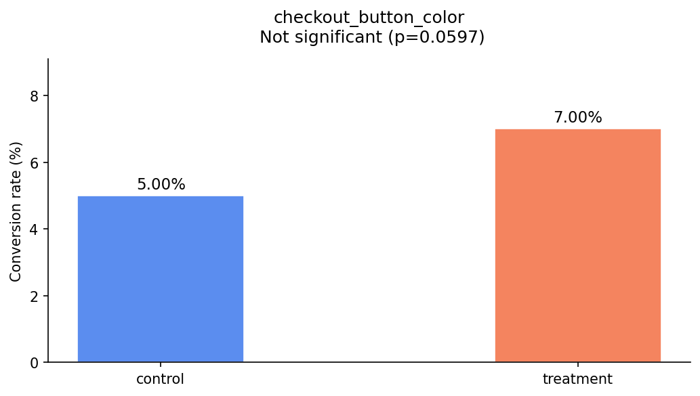

# A/B Testing Framework

A Python library for running statistically rigorous A/B tests — built from scratch.

Covers statistical testing, power analysis, experiment logging, and result visualization.

---

## Features

- **Z-test** — conversion rate comparison (large samples)
- **T-test** — continuous metric comparison (e.g. avg order value)
- **Chi-square test** — categorical outcome comparison
- **Power analysis** — compute required sample size before running experiments
- **MDE calculator** — minimum detectable effect for a fixed sample size
- **Experiment class** — log results, auto-select test, detect underpowered runs
- **Visualizations** — conversion bar charts, confidence interval plots, experiment logs

---

## Installation

```bash
git clone https://github.com/krishnaagarwal80777-droid/ab-testing-framework.git
cd ab-testing-framework
pip install -e .
```

---

## Quick start

```python
from abtest.experiment import Experiment

exp = Experiment(
    name="checkout_button_color",
    baseline_rate=0.05,
    min_detectable_effect=0.02,
)

exp.log_result("control",   users=1000, conversions=50)
exp.log_result("treatment", users=1000, conversions=70)

result = exp.analyze()
print(result)
exp.save("results.json")
```

Output:
```
==================================================
Experiment : checkout_button_color
Ran at     : 2026-06-06 02:04:40
==================================================
Control   (control)  : 50/1000 = 5.00%
Treatment (treatment): 70/1000 = 7.00%
Lift       : +2.00%

[Z-test]
  Statistic : 1.8831
  p-value   : 0.0597
  Result    :  Not significant (α = 0.05)

 Underpowered: needed 2,213 users/group, got 1,000
==================================================
```

---

## Power analysis

```python
from abtest.power import compute_sample_size, minimum_detectable_effect

# How many users do I need?
result = compute_sample_size(baseline_rate=0.05, min_detectable_effect=0.02)
print(result)
# Required n per group: 2,213

# What can I detect with 1000 users?
mde = minimum_detectable_effect(baseline_rate=0.05, n=1000)
print(f"Smallest detectable effect: +{mde:.1%}")
# Smallest detectable effect: +3.1%
```

---

## Visualizations

```python
from abtest.visualize import plot_conversion_rates, plot_confidence_interval

plot_conversion_rates(result)
plot_confidence_interval(result)
```




---

## Project structure

```
abtest/
├── stats.py        # Z-test, T-test, Chi-square
├── power.py        # Sample size calculator, MDE
├── experiment.py   # Experiment class, logging
└── visualize.py    # Matplotlib charts
```

---

## Motivation

Built this after reaching the finals of the **American Express Campus Challenge 2025** (Product Track, top 38 of 2,201 participants) — where A/B testing came up repeatedly in product analytics discussions. Wanted to understand the statistics end-to-end rather than just calling `scipy.stats`.
